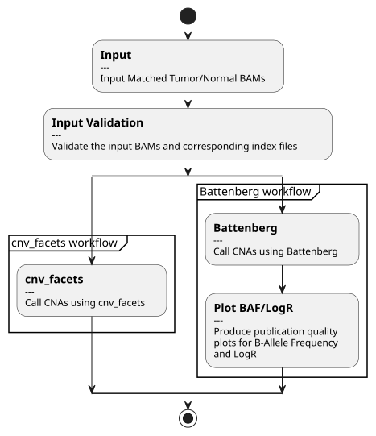

# call-sCNA

[](https://github.com/TheBoutrosLab/pipeline-call-sCNA/releases)

- [Overview](#overview)
- [How to run](#how-to-run)
- [Flow diagram](#flow-diagram)
- [Pipeline steps](#pipeline-steps)
- [Inputs](#inputs)
- [Configuration](#configuration)
- [Outputs](#outputs)
- [Profiles](#profiles)
- [References](#references)
- [Discussions](#discussions)
- [Contributors](#contributors)
- [License](#license)

## Overview

call-sCNA is a Nextflow pipeline for calling somatic copy-number aberrations (sCNAs) from one tumour BAM and its matched normal BAM. It supports two callers:

- [CNV_FACETS](https://github.com/dariober/cnv_facets), a wrapper around [FACETS](https://github.com/mskcc/facets), for whole-genome, whole-exome, and targeted sequencing.
- [Battenberg](https://github.com/Wedge-lab/battenberg) for clonal and subclonal copy-number analysis of whole-genome sequencing data.

The Battenberg workflow also:

- suggests alternative purity and ploidy refits;
- produces per-chromosome and genome-wide B-allele frequency (BAF) and log R plots with [BoutrosLab Plotting General](https://github.com/TheBoutrosLab/package-BoutrosLab-plotting-general); and
- extracts CNA signatures with [SigProfilerExtractor](https://github.com/SigProfilerSuite/SigProfilerExtractor).

The pipeline supports local execution and Slurm-based HPC execution using Docker, Apptainer, or Singularity containers.

## How to run

The pipeline must be run with exactly one tumour BAM and one matched normal BAM. Each BAM must contain a single sample identifier in its read-group `SM` tags, and the two BAMs must have different identifiers.

1. Copy and edit the example [configuration file](config/template.config).
2. Copy and edit the example [input YAML](input/input-call-sCNA.yaml).
3. Run the pipeline:

```bash
nextflow run /path/to/pipeline-call-sCNA/main.nf \
    -config /path/to/sample.config \
    -params-file /path/to/input-call-sCNA.yaml
```

Add `-profile docker`, `-profile apptainer`, or `-profile singularity` to select a container runtime explicitly. The default `standard` profile uses Docker.

## Flow diagram



## Pipeline steps

### 1. Validate inputs

PipeVal validates the input BAMs and records process-specific command logs. BAM and reference indexes are discovered automatically where supported.

### 2. Call sCNAs with CNV_FACETS

CNV_FACETS uses the tumour/normal BAM pair and a dbSNP VCF to calculate allele counts and call allele-specific copy-number changes. An optional target BED restricts analysis for targeted sequencing. The workflow publishes a compressed VCF and index, allele counts, and diagnostic plots.

Key parameters include mapping and base-quality thresholds, normal-depth limits, segmentation critical values, SNP spacing, and random seed. See [CNV_FACETS configuration](#cnv_facets-configuration).

### 3. Call clonal and subclonal CNAs with Battenberg

Battenberg uses the tumour/normal BAM pair, sample sex, and a mounted Battenberg reference bundle to estimate purity, ploidy, and clonal or subclonal copy-number states. The workflow publishes the copy-number profile, purity/ploidy results, BAF and log R data, and diagnostic plots.

The pipeline then validates Battenberg's default refit suggestions and may publish a custom refit suggestion constrained by the configured purity and ploidy ranges.

### 4. Generate BAF and log R plots

For both tumour and normal samples, BoutrosLab Plotting General generates:

- per-chromosome BAF and log R plots; and
- genome-wide BAF and log R plots using either serial index or genomic-position scaling.

### 5. Extract CNA signatures

The Battenberg copy-number profile is converted to SigProfilerExtractor segmentation input. SigProfilerExtractor then generates the CNV48 matrix, extracted signatures, COSMIC templates, seeds, and job metadata.

## Inputs

### Input YAML

| Field | Type | Required | Description |
|:------|:-----|:---------|:------------|
| `patient_id` | string | yes | Patient identifier. |
| `input.BAM.normal` | list of paths | yes | Exactly one matched-normal BAM. |
| `input.BAM.tumor` | list of paths | yes | Exactly one tumour BAM. |

```yaml
---
patient_id: "patient_id"
input:
  BAM:
    normal:
      - "/absolute/path/to/normal.bam"
    tumor:
      - "/absolute/path/to/tumor.bam"
```

Sample identifiers are read from the BAM headers; they are not specified separately in the YAML. BAM indexes must be available alongside the BAMs using a supported index filename.

## Configuration

The complete example is in [config/template.config](config/template.config), and validation rules are defined in [config/schema.yaml](config/schema.yaml).

### General configuration

| Parameter | Type | Required | Description |
|:----------|:-----|:---------|:------------|
| `dataset_id` | string | yes | Dataset identifier used in standardized output filenames. |
| `genome_build` | string | yes | Input genome build: `GRCh37` or `GRCh38`. Default: `GRCh38`. |
| `algorithm` | list | yes | Callers to run. Accepted values are `Battenberg` and `cnv_facets`; values are case-sensitive. |
| `target_bed` | path | no | Target-region BED. Applied only to CNV_FACETS. |
| `output_dir` | path | yes | Base output directory. |
| `work_dir` | path | no | Nextflow work directory. Fast storage with sufficient capacity is recommended. |
| `save_intermediate_files` | boolean | yes | Retain configured intermediate outputs. Default: `false`. |
| `apptainer_library` | path | no | Readable directory containing existing Apptainer images. |
| `apptainer_cache` | path | no | Writable Apptainer image-cache directory. |
| `singularity_library` | path | no | Readable directory containing existing Singularity images. |
| `singularity_cache` | path | no | Writable Singularity image-cache directory. |

### Battenberg configuration

| Parameter | Type | Required | Description |
|:----------|:-----|:---------|:------------|
| `sample_sex` | string | yes | `male` or `female`. |
| `battenberg_reference` | path | yes | Battenberg reference-bundle directory mounted inside the Battenberg container. |
| `min_rho` | number | yes | Minimum tumour purity. Default: `0.1`. |
| `max_rho` | number | yes | Maximum tumour purity. Default: `1.0`. |
| `min_psi` | number | yes | Minimum tumour ploidy. Default: `1.6`. |
| `max_psi` | number | yes | Maximum tumour ploidy. Default: `4.8`. |
| `min_goodness_of_fit` | number | yes | Minimum accepted purity/ploidy goodness of fit. Default: `0.63`. |
| `balanced_threshold` | number | yes | BAF threshold beyond which a locus is considered uninformative. Default: `0.51`. |
| `min_normal_depth` | integer | yes | Minimum matched-normal depth for a SNP. Default: `10`. |
| `min_base_qual` | integer | yes | Minimum base quality for allele counting. Default: `20`. |
| `min_map_qual` | integer | yes | Minimum mapping quality for allele counting. Default: `35`. |

### CNV_FACETS configuration

| Parameter | Type | Required | Description |
|:----------|:-----|:---------|:------------|
| `dbSNP_file` | path | yes | Indexed dbSNP VCF containing germline SNP loci. |
| `snp_mapq` | integer | yes | Minimum mapping quality. Default: `1`. |
| `snp_baq` | integer | yes | Minimum base quality. Default: `30`. |
| `depth` | pair of numbers | yes | Minimum and maximum matched-normal depth. Default: `[25, 2500]`. |
| `cval` | pair of numbers | yes | Pre-processing and processing segmentation critical values. Default: `[25, 400]`. |
| `nbhdsnp` | integer | yes | SNP-spacing interval used to reduce serial correlation. Default: `250`. |
| `rnd_seed` | integer | yes | Random-number seed. Default: `0`. |
| `no_cov_plot` | boolean | yes | Suppress the CNV_FACETS coverage plot. Default: `true`. |
| `snp_count_orphans` | boolean | yes | Count anomalous read pairs. Default: `true`. |

### Plot configuration

| Parameter | Type | Required | Description |
|:----------|:-----|:---------|:------------|
| `position_scale` | string | yes | Genome-wide plot scale: `index` or `genome-position`. Default: `genome-position`. |
| `bpg_plot_resolution` | integer | yes | Plot resolution in DPI. Default: `200`. |
| `reference_dict` | path | yes | Sequence dictionary used to obtain chromosome lengths. |

### CNA-signature configuration

| Parameter | Type | Default | Description |
|:----------|:-----|:--------|:------------|
| `context_type` | string | `default` | Mutation context passed to SigProfilerExtractor. |
| `exome` | boolean | `false` | Enable exome-normalized signature analysis. |
| `min_max_signatures` | pair of numbers | `[1, 25]` | Minimum and maximum signature ranks. |
| `nmf_replicates` | integer | `100` | NMF replicates per rank. |
| `resample` | boolean | `true` | Resample samples with Poisson noise. |
| `seeds` | string | `random` | Seed mode or path to a previous `Seeds.txt`. |
| `matrix_normalization` | string | `gmm` | One of `gmm`, `log2`, `custom`, or `none`. |
| `nmf_init` | string | `random` | NMF initialization method. |
| `precision` | string | `single` | `single` or `double`. |
| `min_max_nmf_iterations` | pair of numbers | `[10000, 1000000]` | Minimum and maximum NMF iterations. |
| `nmf_test_cov` | integer | `10000` | Iterations between convergence checks. |
| `nmf_tolerance` | number | `1e-15` | NMF convergence tolerance. |
| `gpu` | boolean | `false` | Use GPU execution when available. |
| `batch_size` | integer | `1` | NMF replicates assigned per CPU during GPU execution. |
| `stability` | number | `0.8` | Average-stability cutoff. |
| `min_stability` | number | `0.2` | Minimum-stability cutoff. |
| `combined_stability` | number | `1.0` | Combined-stability cutoff. |
| `allow_stability_drop` | boolean | `false` | Allow solutions after a stability drop. |
| `cosmic_version` | number | `3.4` | COSMIC reference-signature version. |
| `make_decomposition_plots` | boolean | `true` | Generate de novo-to-COSMIC decomposition plots. |
| `collapse_to_SBS96` | boolean | `true` | Collapse SBS288 and SBS1536 signatures to SBS96 for decomposition. |
| `get_all_signature_matrices` | boolean | `false` | Retain W and H matrices from all NMF iterations. |
| `export_probabilities` | boolean | `true` | Export the signature probability matrix. |

### Resource overrides

Default process resources are defined in [config/resources.json](config/resources.json). Use `base_resource_update` to multiply the memory or CPU allocation for selected processes:

```nextflow
base_resource_update {
    memory = [
        [[], 2],
        [['call_SubclonalCopyNumber_Battenberg'], 1.5]
    ]
    cpus = [
        [['call_cnv_facets'], 2]
    ]
}
```

An empty process list applies the multiplier to every process. Updates are applied in the order listed.

## Outputs

Results are written below:

```text
<output_dir>/call-sCNA-<pipeline_version>/<tumour_id>/
├── CNV_FACETS-<version>/
│   └── output/
├── Battenberg-<version>/
│   ├── output/
│   └── QC/
├── validation/
└── log-call-sCNA-<version>-<timestamp>/
```

### CNV_FACETS outputs

| Output | Description |
|:-------|:------------|
| `*.vcf.gz` and `*.vcf.gz.tbi` | Allele-specific sCNA calls and tabix index. |
| `*.csv.gz` | Per-SNP allele counts. |
| `*.cnv.png` | Genome-wide copy-number plot. |
| `*.spider.pdf` | Diagnostic purity/ploidy fit plot. |
| `*.sha512` | SHA-512 checksum for the primary VCF and index. |

### Battenberg outputs

| Output | Description |
|:-------|:------------|
| `*_subclones.txt` | Clonal and subclonal copy-number profile. |
| `*_rho_and_psi.txt` | Purity and ploidy estimates. |
| `*_refit_suggestion.txt` | Battenberg's default refit suggestion. |
| `*_custom_refit_suggestion.txt` | Optional refit suggestion constrained by the configured ranges. |
| `*.tab` | Tumour and normal BAF/log R data. |
| `*.png` | Battenberg diagnostic and copy-number plots. |
| `*.sha512` | SHA-512 checksum for the primary subclones file. |

See the [Battenberg output documentation](https://github.com/Wedge-lab/battenberg#description-of-the-output) for details.

### QC and CNA-signature outputs

| Output | Description |
|:-------|:------------|
| `*BAF*.png`, `*LogR*.png` | Per-chromosome and genome-wide BAF/log R plots. |
| `*seg_input.txt` | Battenberg segmentation input prepared for SigProfilerExtractor. |
| `*BATTENBERG.CNV48.matrix.tsv` | CNV48 count matrix. |
| `*CNV48/` | SigProfilerExtractor CNA-signature results. |
| `*CosmicTemplates/` | COSMIC reference templates used during decomposition. |
| `*JOB_METADATA.txt` | SigProfilerExtractor run metadata. |
| `*Seeds.txt` | Random seeds used by SigProfilerExtractor. |

Pipeline validation, process logs, parameters, Nextflow trace, timeline, and execution report are stored in the validation and timestamped log directories.

## Profiles

Select a container runtime with the Nextflow `-profile` option:

- `standard` or `docker`: Docker
- `apptainer`: Apptainer
- `singularity`: Singularity

## References

1. [FACETS](https://github.com/mskcc/facets)
2. [CNV_FACETS](https://github.com/dariober/cnv_facets)
3. [Battenberg](https://github.com/Wedge-lab/battenberg)
4. [BoutrosLab Plotting General](https://github.com/TheBoutrosLab/package-BoutrosLab-plotting-general)
5. [SigProfilerExtractor](https://github.com/SigProfilerSuite/SigProfilerExtractor)

## Discussions

- Use the [issue tracker](https://github.com/TheBoutrosLab/pipeline-call-sCNA/issues) for bug reports and enhancement requests.
- Use [GitHub Discussions](https://github.com/TheBoutrosLab/pipeline-call-sCNA/discussions) for general questions.
- Proposed code changes are welcome through [pull requests](https://github.com/TheBoutrosLab/pipeline-call-sCNA/pulls).

## Contributors

See the repository's [contributors](https://github.com/TheBoutrosLab/pipeline-call-sCNA/graphs/contributors).

## License

Authors: Yash Patel

call-sCNA is licensed under the GNU General Public License version 2. See [LICENSE](LICENSE) for the full terms.

Copyright (C) 2026 Sanford Burnham Prebys Medical Discovery Institute ("Boutros Lab"). All rights reserved.

This program is free software; you can redistribute it and/or modify it under the terms of the GNU General Public License as published by the Free Software Foundation; either version 2 of the License, or (at your option) any later version.

This program is distributed in the hope that it will be useful, but WITHOUT ANY WARRANTY; without even the implied warranty of MERCHANTABILITY or FITNESS FOR A PARTICULAR PURPOSE. See the GNU General Public License for more details.
